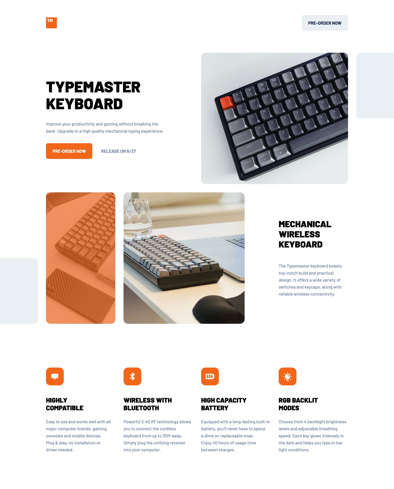

# Frontend Mentor - Typemaster pre-launch landing page solution

This is a solution to the [Typemaster pre-launch landing page challenge on Frontend Mentor](). Frontend Mentor challenges help you improve your coding skills by building realistic projects.

## Table of contents

- [Frontend Mentor - Typemaster pre-launch landing page solution](#frontend-mentor---typemaster-pre-launch-landing-page-solution)
  - [Table of contents](#table-of-contents)
  - [Overview](#overview)
    - [The challenge](#the-challenge)
    - [Screenshot](#screenshot)
    - [Links](#links)
  - [My process](#my-process)
    - [Built with](#built-with)
    - [What I learned](#what-i-learned)
    - [Useful resources](#useful-resources)
  - [Author](#author)

## Overview

### The challenge

Users should be able to:

- View the optimal layout depending on their device's screen size
- See hover states for interactive elements

### Screenshot

### Links

- Solution URL: [Github](https://github.com/katrien-s/fe-24-008-typemaster-pre-launch-landing-page)
- Live Site URL: [Netlify](https://moonlit-stroopwafel-a56dfd.netlify.app/)

## My process

### Built with

- Semantic HTML5 markup
- CSS custom properties
- Flexbox
- CSS Grid
- Mobile-first workflow

### What I learned

I began this exercise a long time ago. I've refactored the css going from entire class-based styling to using more variables and custom properties.
There was a long search on how to do the full bleed properly. Which I've learned now thanks to the tutorial [How to make full bleed wrappers with CSS grid](https://www.youtube.com/watch?v=6l24PIccgqU) provided by [Coder Coder](https://www.youtube.com/@TheCoderCoder). This allowed me to have the images or gray squares, run off the page.

### Useful resources

- [Breakpoints](https://getbootstrap.com/docs/5.0/layout/breakpoints/) - I saw it mentioned by Jes Chan in one of her YouTube video's by [Coder Coder](https://www.youtube.com/@TheCoderCoder) that she uses these Bootstrap-breakpoints setting, in order to have a smooth transition the responsive layout across device or viewport sizes. I took inspiration here to set my media-queries.
- [How to Use HTML5 “picture”, “srcset”, and “sizes” for Responsive Images](https://webdesign.tutsplus.com/quick-tip-how-to-use-html5-picture-for-responsive-images--cms-21015t)
- [How to make full bleed wrappers with CSS grid](https://www.youtube.com/watch?v=6l24PIccgqU) - A video by [Coder Coder](https://www.youtube.com/@TheCoderCoder) again
- [How to overlay image with color in CSS?](https://stackoverflow.com/questions/18815157/how-to-overlay-image-with-color-in-css)

## Author

- Website - [katriens.be](https://www.katriens.be)
- Frontend Mentor - [@katrien-s](https://www.frontendmentor.io/profile/katrien-s)
